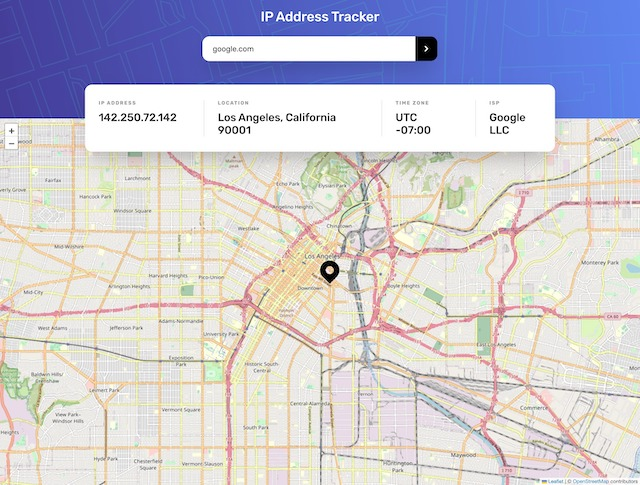
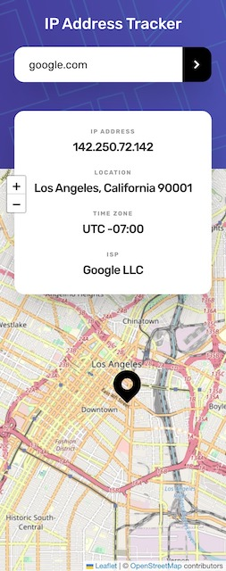

# Frontend Mentor - IP address tracker solution

This is a solution to the [IP address tracker challenge on Frontend Mentor](https://www.frontendmentor.io/challenges/ip-address-tracker-I8-0yYAH0). Frontend Mentor challenges help you improve your coding skills by building realistic projects.

## Table of contents

- [Frontend Mentor - IP address tracker solution](#frontend-mentor---ip-address-tracker-solution)
  - [Table of contents](#table-of-contents)
  - [Overview](#overview)
    - [The challenge](#the-challenge)
    - [Screenshot](#screenshot)
      - [Desktop](#desktop)
      - [Mobile](#mobile)
    - [Links](#links)
  - [My process](#my-process)
    - [Built with](#built-with)
    - [What I learned](#what-i-learned)
    - [Continued development](#continued-development)
    - [Useful resources](#useful-resources)
  - [Author](#author)
  - [Acknowledgments](#acknowledgments)

## Overview

### The challenge

Users should be able to:

- View the optimal layout for each page depending on their device's screen size
- See hover states for all interactive elements on the page
- See their own IP address on the map on the initial page load
- Search for any IP addresses or domains and see the key information and location

### Screenshot

#### Desktop

#### Mobile

Add a screenshot of your solution. The easiest way to do this is to use Firefox to view your project, right-click the page and select "Take a Screenshot". You can choose either a full-height screenshot or a cropped one based on how long the page is. If it's very long, it might be best to crop it.

Alternatively, you can use a tool like [FireShot](https://getfireshot.com/) to take the screenshot. FireShot has a free option, so you don't need to purchase it.

Then crop/optimize/edit your image however you like, add it to your project, and update the file path in the image above.

### Links

- Solution URL: [Frontend Mentor](https://www.frontendmentor.io/solutions/ip-tracker-with-react-tailwindcss-axios--_uxxpzDhu)
- Live Site URL: [Vercel](https://ip-tracker-cbserra.vercel.app/)

## My process

### Built with

- Semantic HTML5 markup
- Tailwind CSS
- Flexbox
- useAxios Hook
- Mobile-first workflow
- [React](https://reactjs.org/) - JS library
- [React Leaflet](https://react-leaflet.js.org/) / [LeafletJS](https://leafletjs.com/) Mapping APIs
- [IP Geolocation API by IPify](https://geo.ipify.org/)

### What I learned

Be careful while developing with APIs which limit your access via credits -- one small mistake in your REST calls could burn through your credits!

### Continued development

Need to continue work on my API interactions. Still searching for better ways to call APIs in React -- besides `useEffect` blocks which seem to get me stuck in recursive loops that burn through my API credits!

### Useful resources

- [Favicon.io](https://favicon.io/) - Generate your own favicon's, from text, images, or emojis

## Author

- Github - [cbserra](https://www.github.com/cbserra)
- Frontend Mentor - [@cbserra](https://www.frontendmentor.io/profile/cbserra)

## Acknowledgments

StackOverflow, API documentation.
